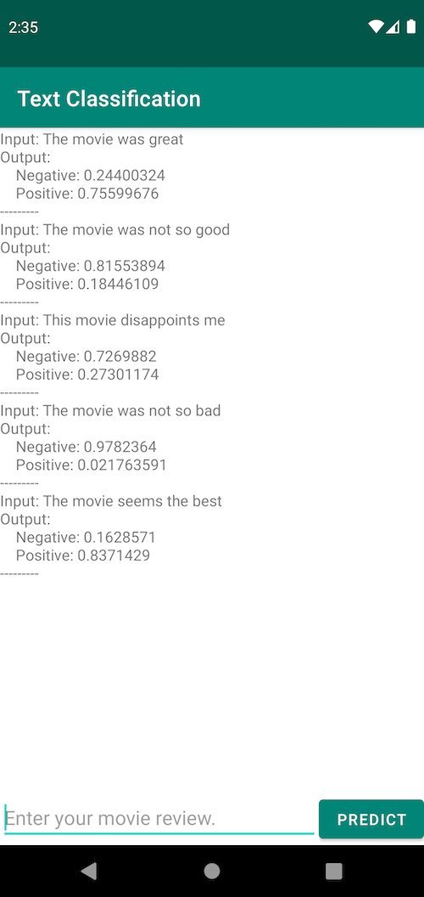

# Text Classifier Android example
The app uses `Tensorflow lite` text model to analyse movie review & categorize them in either positve or negative sentiments.

Sentiment analysis is the interpretation and classification of emotions (positive, negative and neutral) within text data using text analysis techniques.

This project shows how to build a machine learning model for sentiment analysis, in particular classifying text as positive or negative. This is an example of binary—or two-class—classification, an important and widely applicable kind of machine learning problem.

## Screenshot

## Requirements

*  Android Studio Arctic Fox(installed on a Linux, Mac or Windows machine)
*  An Android device, or an Android Emulator

## Build and run

### Step 1. Setup Firebase

https://firebase.google.com/docs/android/setup

### Step 2. Using Custom Model

https://firebase.google.com/docs/ml/android/use-custom-models#kotlin+ktx_1

### Step 3. Import the sample app to Android Studio

Open the source code in Android Studio. To do this, open Android
Studio and select `Import Projects->Select the project folder`

### Step 4. Run the Android app

Connect the Android device to the computer and be sure to approve any ADB
permission prompts that appear on your phone. Select `Run -> Run app.` Select
the deployment target in the connected devices to the device on which the app
will be installed. This will install the app on the device.

To test the app, open the app called `Text Classification` on your device.
Re-installing the app may require you to uninstall the previous installations.
